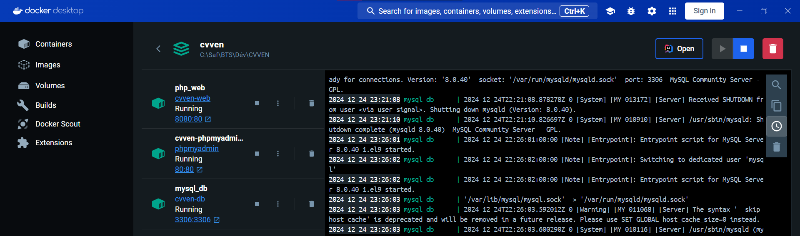

# Création projet CVVEN : Docker

## Installer Docker Desktop

Pour linux : 

[Ubuntu](https://docs.docker.com/desktop/setup/install/linux/ubuntu/)

Pour Windows : 

[Windows](https://docs.docker.com/desktop/setup/install/windows-install/)

## Importer projet Docker

```bash
git clone https://github.com/AffaneSafouane/CVVEN.git 
```

Ouvrez un terminal dans votre projet et lancer la commande :

```bash
docker compose up -d
```

L’utilisateur mysql est *root* et le mot de passe est : *adminSQL1234ADC+*

ATTENTION: Il ne faut pas que les ports utiliser par les conteneurs soient déjà occupés, par XAMPP par exemple. 

Pour facilement accéder aux pages web de phpmyadmin ou du projet cvven, il suffit d'aller dans l'application docker desktop : 
- Cliquer sur le compose (cvven dans notre cas)


- Cliquer sur le lien web contenant les ports (8080:80 pour cvven, 80:80 pour phpmyadmin)

  
## Debuggage ou commandes internes
Si vous souhaitez exécuter des commandes depuis le terminal d'un conteneur vous devez exécuter les commandes suivantes : 

- Pour php
```bash
docker exec -it php_web sh
```

- Pour mysql
```bash
docker exec -it mysql_db sh
```

- Pour phpmyadmin
```bash
docker exec -it cvven-phpmyadmin sh
```

Vous pouvez également accéder à la console depuis l'application docker desktop : 
- Cliquer sur le compose


- Cliquer sur le conteneur depuis lequel vous voulez utiliser le terminal de commmande (php_web pour le serveur web, ou mysql_db pour la base de données)


- Enfin cliquer sur l'onglet exec et exécuter la commande souhaiter
